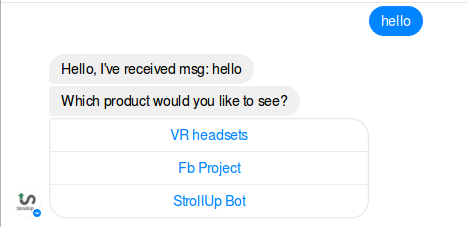
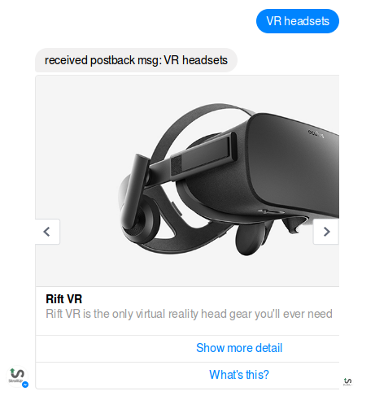

##How to deploy locally
 - checkout and export this project as maven project in eclipse
 - create a run configuration for this project 
   - with goals: `jetty:run -Djetty.port=9090`
   - with name: `Java-FbChatBot`
   - with base directory: `${workspace_loc:/Java-FbChatBot}`
 - you can change the port (9090) to whatever you want
 - check your project 
    - [home](http://localhost:9090/bot/) 
    - [webhook](http://localhost:9090/bot/webhook?hub.verify_token=whatever_string_you_or_your_friends_wish&hub.challenge=your_name)
  
 
##run on ngrok
 - now you have to setup [ngrok](https://ngrok.com/) which is the easiest way to expose your local server to the world 
 - now run ngrok for port 9090 as `ngrok http -subdomain=mybot -log=stdout 9090`
 - check your project 
    - [home](https://mybot.ngrok.io/bot/) 
    - [webhook](https://mybot.ngrok.io/bot/webhook?hub.verify_token=whatever_string_you_or_your_friends_wish&hub.challenge=your_name)
 - now add webhook url as show in [fb tutorial](https://developers.facebook.com/docs/messenger-platform/implementation#setup_webhook)
 
##output in fb messenger
 - once you are done with fb  webhook setup, you can message on your page and will get automated replies as shown in pictures below

Normal text by a user

  
  
Postbacks (button click by a user in messenger)

  
 
 
